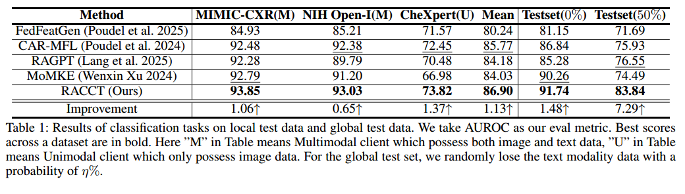
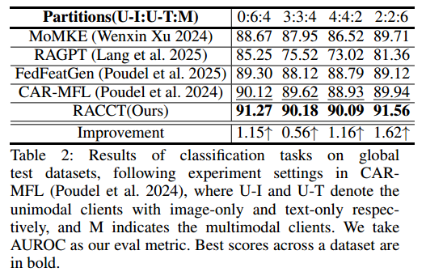

## RACCT

### Abstract

Federated learning (FL) enables hospitals to collaboratively train diagnostic models without exchanging sensitive patient records. However, the vast majority of FL methods assume that each client holds data from every modality, which is impractical in healthcare settings where different sites may acquire only a subset of modalities. Although recent multimodal federated learning (MMFL) approaches attempt to bridge this gap, they often struggle when some clients lack one or more modalities.To solve the problem,  Retrieval-based and reconstruction-based methods were proposed for imputing missing modalities. But they tend to discard important original information of raw data and introduce spurious noise, causing some clients' models to drift away from the global optimum.To overcome these limitations, we propose $\textit{\textbf{R}etrieval-\textbf{A}ugmented \textbf{C}ross-modal \textbf{C}onverter \textbf{T}uning}$, named **RACCT**, a novel framework for handling missing modalities in MMFL. First, a cross‑modal converter learns to convert representation of available modalities into those of missing modalities, thereby preserving the original information of the raw data. Second, retriever and dual-path fusion module effectively fuse representation converted from existing modalities and similar data retrieved from public database, enriching the synthesized representation of missing modality and significantly attenuating impact of noise. By jointly optimizing these components within the federated learning framework, RACCT ensures that all participating clients converge toward a more accurate and globally consistent diagnostic model. Experiments on four real-world medical datasets demonstrate that our framework consistently outperforms state-of-the-art methods in handling missing modality scenarios in MMFL. 


### Dependencies

```  
conda env create -f environment.yml 
```


### Prepare Data 

MIMIC-CXR: You can download data from https://physionet.org/content/mimic-cxr/2.0.0/

NIH Open-I: You can download data from https://www.kaggle.com/datasets/raddar/chest-xrays-indiana-university

CheXpert: You can download data from https://www.kaggle.com/datasets/ashery/chexpert


### annotation for data

in **RACCT/annot/** directory, put three pkl file, you can download them from [here](https://naamii-my.sharepoint.com/personal/pranav_poudel_naamii_org_np/_layouts/15/onedrive.aspx?id=%2Fpersonal%2Fpranav%5Fpoudel%5Fnaamii%5Forg%5Fnp%2FDocuments%2FCAR%2DFML&ga=1) 


#### preprocessing

python mimic-preprocessing/mimic_jpg_resized.py (According to https://github.com/bhattarailab/CAR-MFL)


#### preprare model

you can download pretrained model from https://huggingface.co/dandelin/vilt-b32-mlm/tree/main


### Model Performance

We compare our model with several baseline methods on disease classification test on MIMIC-CXR testset in our seetting(table1) and CAR-MFL

setting(table2) .







### Runing experiments

Run our setting, please 

```python
python main.py --gpu 0 --loginfo "./log/racct.txt" --prefix "racct" --method "racct"
```


Run CAR-MFL setting, please 

```python
python main.py --img_clients 3 --txt_clients 3 --num_clients 4 --gpu 0 --loginfo "./log/racct-car.txt" --prefix "racct-car" --method "racct"
```


